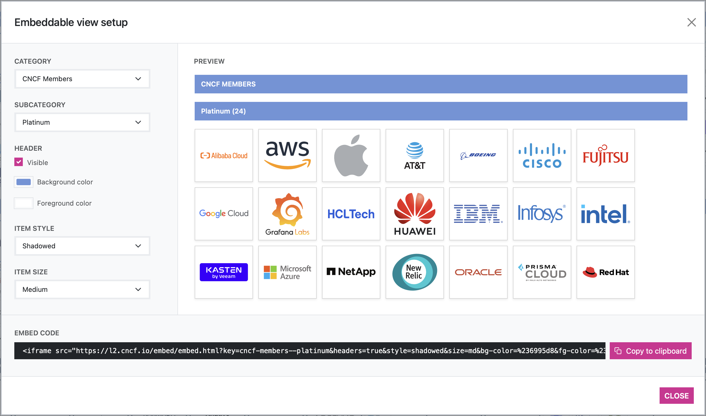

# Landscape

**Landscape** is a tool that generates interactive landscapes websites.

You can check out how the generated landscapes look like by visiting the [KhulnaSoft landscape](https://landscape.khulnasoft.io). Additional landscapes generated by this tool can be found in the [landscape-sites repository](https://github.com/khulnasoft/landscape-sites#landscape-sites).

> [!WARNING]
> Landscape is at an early stage of development. There may be breaking changes in the future to the command usage, flags, and configuration file formats.

<br/>
<table>
    <tr>
        <td width="50%"></td>
        <td width="50%"></td>
    </tr>
    <tr>
        <td width="50%"></td>
        <td width="50%"></td>
    </tr>
    <tr>
        <td width="50%"></td>
        <td width="50%"></td>
    </tr>
</table>

## How it works

**Landscape** is a CLI tool that generates static websites from the information available in the data sources provided. These data sources are passed to the tool via arguments, usually in the form of *urls* or *local paths*, and are as follows:

- **Landscape data**. The landscape data file is a YAML file that describes the items that will be displayed in the landscape website. For more information, please see the [reference documentation](https://github.com/khulnasoft/landscape/blob/main/docs/config/data.yml).

- **Landscape settings**. The settings file is a YAML file that allows customizing some aspects of the generated landscape website, such as the logo, colors, how to group items or which ones should be featured. For more information about the settings file, please see the [reference documentation](https://github.com/khulnasoft/landscape/blob/main/docs/config/settings.yml).

- **Landscape guide**. The guide file is a YAML file that defines the content of the guide that will be displayed on the landscape website. For more information, please see the [reference documentation](https://github.com/khulnasoft/landscape/blob/main/docs/config/guide.yml).

- **Landscape games**. The games data file is a YAML file that defines the content of the games that will be displayed on the landscape website. For more information, please see the [reference documentation](https://github.com/khulnasoft/landscape/blob/main/docs/config/games.yml).

- **Logos location**. Each landscape item *must* provide a valid relative reference to a logo image in SVG format in the landscape data file (item's `logo` field). The logos data source defines the location of those logos (base *url* or *local path*), so that the tool can get them as needed when processing the landscape items.

### Data collection from external services

In addition to the information available in the landscape data file, the tool collects more data *during the landscape generation* from external sources (such as **GitHub** or **Crunchbase**) if the required credentials are provided. These credentials must be provided via environment variables.

- **GitHub**: a list of comma separated GitHub tokens with `public_repo` scope can be provided in the `GITHUB_TOKENS` environment variable. When these tokens are not provided no information from GitHub will be collected. If the expected number of items in the landscape is large it is recommended to provide more than one token to avoid hitting rate limits and speed up the collection of data (the concurrency of the process will be based on the number of tokens provided).

- **Crunchbase**: a Crunchbase API key can be provided in the `CRUNCHBASE_API_KEY` environment variable. If this token is not provided no information from Crunchbase will be collected. Please note that landscape *needs access to the full Crunchbase API*, which requires an [Enterprise or Application license](https://data.crunchbase.com/docs/using-the-api).

## Installation

### Pre-built binaries

Binary downloads of the landscape CLI tool can be found in the [releases page](https://github.com/khulnasoft/landscape/releases).

#### Install via Homebrew

```text
brew install khulnasoft/landscape/landscape
```

#### Install via shell script

```text
curl --proto '=https' --tlsv1.2 -LsSf https://github.com/khulnasoft/landscape/releases/download/v0.10.0/landscape-installer.sh | sh
```

#### Install via powershell script

```text
irm https://github.com/khulnasoft/landscape/releases/download/v0.10.0/landscape-installer.ps1 | iex
```

### Container image

The landscape CLI tool is also distributed in a [container image](https://hub.docker.com/r/khulnasoft/landscape). This image can be used both to run the tool locally or from your [CI workflows to automate the generation of landscapes](https://github.com/khulnasoft/landscape-sites/tree/main/.github/workflows). The [landscape-validate-action](https://github.com/khulnasoft/landscape-validate-action), which can be used to check that the landscape data, settings and guide files are valid, also uses this image.

### Building from source

You can build **landscape** from the source by using [Cargo](https://rustup.rs), the Rust package manager. [wasm-pack](https://rustwasm.github.io/wasm-pack/installer/) is required to build the wasm modules. [yarn](https://classic.yarnpkg.com/lang/en/docs/install/) is also required during the installation process to build the web application, which will be embedded into the `landscape` binary as part of the build process.

```text
cargo install --git https://github.com/khulnasoft/landscape
```

```text
landscape --help

Landscape CLI tool

https://github.com/khulnasoft/landscape#usage

Usage: landscape <COMMAND>

Commands:
  build     Build landscape website
  deploy    Deploy landscape website (experimental)
  new       Create a new landscape from the built-in template
  serve     Serve landscape website
  validate  Validate landscape data sources files
  help      Print this message or the help of the given subcommand(s)
```

## Usage

To see **landscape** in action, we will go through the process of creating, building and serving a new landscape from scratch. The following instructions will assume that the `landscape` binary is available in your PATH. Alternatively, you can launch a container from the [image provided](https://hub.docker.com/r/khulnasoft/landscape) where the **landscape** CLI tool is ready to use.

### Creating a new landscape

The `new` subcommand allows us to create a new landscape from a built-in template. This template includes some sample data source files that you can use as a starting point for your landscapes.

The following command will create the directory `my-landscape` if it doesn't already exist and will copy into it the files in the built-in template:

```text
landscape new --output-dir my-landscape
```

```text
INFO new: landscape::new: creating new landscape from the built-in template..
INFO new: landscape::new: landscape created! (took: 0.003s)

✅ Landscape created successfully!

You can build it by running the following command from the `my-landscape` directory:

👉 landscape build --data-file data.yml --settings-file settings.yml --guide-file guide.yml --logos-path logos --output-dir build
```

### Building the landscape website

The build process is in charge of generating the landscape website from the information available in the data sources provided. Now we'll build the landscape we created in the previous step by using the `build` subcommand. Please note that the `new` subcommand already suggested us to do this in its output and even printed the full command to use for us.

> [!NOTE]
> During the build process, landscape will try to take a screenshot of your landscape if the required settings were provided in the settings.yml file. This screenshot will be available for download from the generated web application (in PNG and PDF format), and is taken by launching Chrome/Chromium in headless mode. If Chrome/Chromium is not available, the screenshot won't be taken and a warning will be raised.

The following command will build the landscape and write the resulting files to the `output-dir` provided (*build* in this case):

```text
cd my-landscape
```

```text
landscape build \
  --data-file data.yml \
  --settings-file settings.yml \
  --guide-file guide.yml \
  --logos-path logos \
  --output-dir build
```

```text
INFO build: landscape::build: building landscape website..
WARN build:collect_crunchbase_data: landscape::build::crunchbase: crunchbase api key not provided: no information will be collected from crunchbase
WARN build:collect_github_data: landscape::build::github: github tokens not provided: no information will be collected from github
INFO build: landscape::build: landscape website built! (took: 0.555s)

✅ Landscape built successfully!

You can see it in action by running the following command:

👉 landscape serve --landscape-dir build
```

> [!IMPORTANT]
> Without the credentials required to collect data from external services (GitHub and Crunchbase) the resulting site won't contain all the information available on the KhulnaSoft demo site. In this case, we didn't provide them intentionally, so we were warned about it in the command output (see WARN entries).

### Serving a landscape

The result of the build process is a **static website** that you can deploy on your favorite hosting provider. To make it easier to try your landscapes, **landscape** includes a `serve` subcommand that will launch an HTTP server and serve the contents of your landscape. In our example, the build output displayed the command to do this, so we'll go ahead and give it a try:

```text
landscape serve --landscape-dir build
```

```text
INFO serve: landscape::serve: http server running (press ctrl+c to stop)

🔗 Landscape available at: http://127.0.0.1:8000
```

If you visit `http://127.0.0.1:8000` in your browser you should see the landscape you just created in action. Now you can iterate by editing the files in the `my-landscape` directory until your landscape is ready.

One option to serve your landscape in production is to use a static site hosting service like [GitHub Pages](https://pages.github.com). In [this repository](https://github.com/tegioz/sample-landscape) you can find a full example of a landscape generated by the `landscape new` command that is automatically built and deployed to GitHub pages (using the `build` branch) on every commit to the `main` branch. Please note that the [sample workflow used to build and deploy](https://github.com/tegioz/sample-landscape/blob/main/.github/workflows/build.yml) requires **write** permissions.

> [!NOTE]
> The resulting website when building a landscape is a [single-page application](https://en.wikipedia.org/wiki/Single-page_application) that handles routing on the client side. This means that you'll need to configure your webserver to serve the `index.html` file for the SPA route paths (like '/guide', '/stats', etc). One way of doing this would be to serve that file when a non existent path is requested. The `serve` subcommand included in **landscape** already handles this for us. In the GitHub pages example mentioned above, this is achieved by copying the content of the `index.html` file to the `404.html` file, which will be served when a non existent path is requested.

### Validating data, settings and guide files

The **landscape** CLI tool includes a subcommand named `validate` that allows you to check that your landscape data, settings and guide files are valid. If you are interested in integrating this validation in your CI workflows (i.e. to enforce that those files are valid before merging a PR), please take a look at the [landscape-validate-action](https://github.com/khulnasoft/landscape-validate-action).

```text
landscape validate settings --settings-file khulnasoft/settings.yml

Error: the landscape settings file provided is not valid

Caused by:
    0: the landscape settings file provided is not valid
    1: color1 is not valid (expected format: "rgba(0, 107, 204, 1)")
```

### Performance considerations when building

Some operations like collecting data from external sources or processing a lot of logos images can take some time, specially in landscapes with lots of items. **Landscape** caches as much of this data as possible to make subsequent runs faster. Please keep this in mind when running the tool periodically from your workflows, and make sure the cache directory (set via `--cache-dir`) is saved and restored on each run. You can find some examples of how to achieve this in the [workflows in the landscape-sites repository](https://github.com/khulnasoft/landscape-sites/tree/main/.github/workflows).

### Embeddable views

**Landscape** allows other websites to embed a view to display the items in a category or subcategory. The embed code can be easily obtained from the corresponding landscape website by visiting `/embed-setup` (i.e. in the case of the KhulnaSoft landscape, the url would be <https://landscape.khulnasoft.io/embed-setup>). The customization options available can be adjusted as needed, and the generated embed code will be updated accordingly.



> [!NOTE]
> In addition to the customization options available in the embed setup view, it's also possible to embed views using [iframe-resizer](https://github.com/davidjbradshaw/iframe-resizer). This feature can be enabled by adding `iframe-resizer=true` to the embed url ([demo](https://codepen.io/cynthiasg/pen/WNmQjje)).

### Overlay

**Landscape** supports applying one or more data source files to an existing landscape at runtime. Any of those files can -and often will- be different than the ones used originally to build the landscape. This feature aims to be the building blocks of a preview system.

Some examples of it in action (live demos!):

- [Preview some changes in the settings file (like a Christmas edition theme)](https://landscape.khulnasoft.io/?overlay-settings=https://raw.githubusercontent.com/tegioz/landscape-overlay-tests/main/settings-christmas.yml)
- [Check out how the KhulnaSoft landscape would look like using a 5 years old `landscape.yml` file (Helm was still in incubating!)](https://landscape.khulnasoft.io/?overlay-data=https://raw.githubusercontent.com/khulnasoft/landscape/6ff062c72b7229bbe60fee3aca5f8999624459f2/landscape.yml&overlay-logos=https://raw.githubusercontent.com/khulnasoft/landscape/6ff062c72b7229bbe60fee3aca5f8999624459f2/hosted_logos&overlay-settings=https://raw.githubusercontent.com/tegioz/landscape-overlay-tests/main/settings-5-years-ago.yml)

To achieve this, the overlay redoes part of the landscape build process in the browser, reusing the same codebase packed as a WASM module.

The overlay can be enabled by providing any of the following query parameters to the landscape url (they can be combined if needed):

- `overlay-data`: *data file url*
- `overlay-settings`: *settings file url*
- `overlay-guide`: *guide file url*
- `overlay-games`: *games data file url*
- `overlay-logos`: *logos base url*

> [!WARNING]
> The overlay feature is still experimental and may not work as expected in all cases. Please report any issues you find!

## Adopters

A list of landscapes built using **landscape** is available at [ADOPTERS.md](./ADOPTERS.md). Please consider adding yours!

## Contributing

Please see [CONTRIBUTING.md](./CONTRIBUTING.md) for more details.

## Code of Conduct

This project follows the [KhulnaSoft Code of Conduct](https://github.com/khulnasoft/foundation/blob/master/code-of-conduct.md).

## License

Landscape is an Open Source project licensed under the [Apache License 2.0](https://www.apache.org/licenses/LICENSE-2.0).
